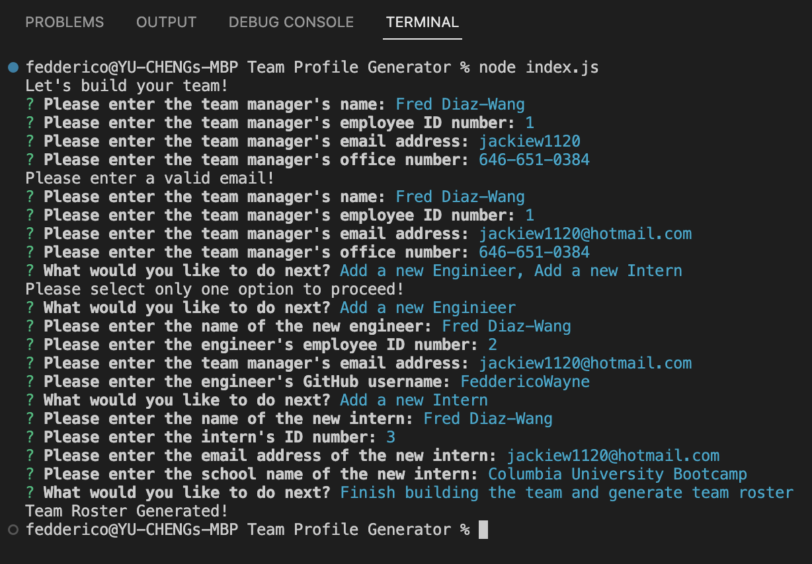
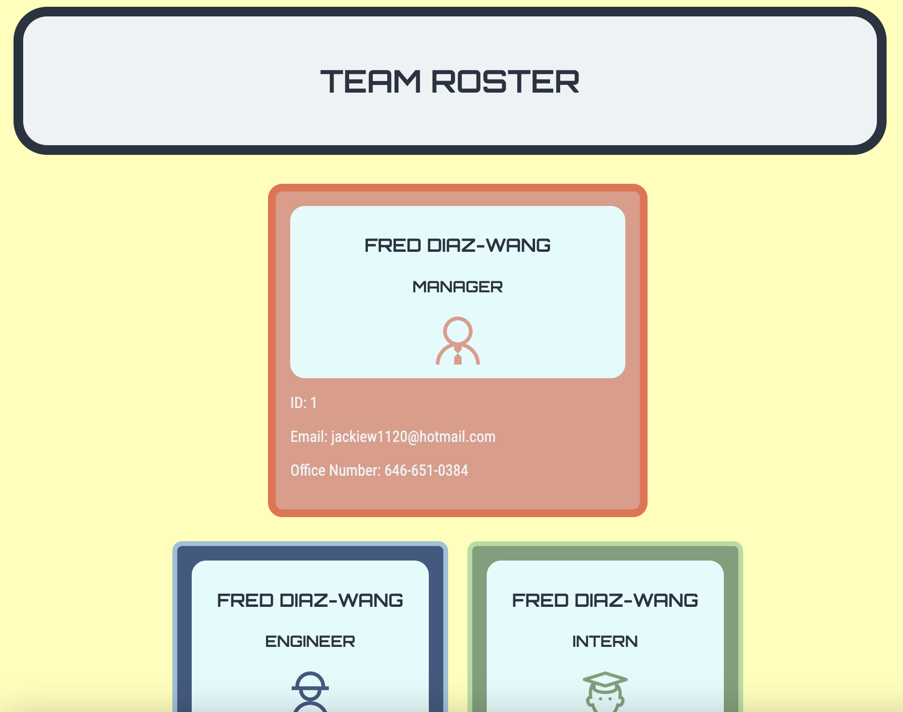

# TEAM PROFILE GENERATOR 

  ## <a id="Description">Description</a> 

    This is a command-line app that's built on node.js with the help of inquirer and jest.

    With this App you can very quickly generate a team roster html page by answering questions prompted by the inquirer package regarding your team members. 

    To start the app, run the command "node index.js", and you'll be prompted to enter the team manager's name, ID, email, and office phone number. If you enter an email address without the "@" symbol, you will be alerted to enter a valid email address, and you'll have to start the manager info process again.
    
    Once you've entered the manager's info correctly, you'll then be shown the menu containing the following three options:

      1) To add an enginieer into your team roster
      2) to add an intern into your team roster
      3) To finish the process and complete the team roster as an html file.
    
    If you select more than one option at once, you will be alerted to only select one option to proceed, and you'll be shown the menu again.

    If you select option (1), you will be prompted to enter the new engineer's name, ID, email, and their GitHub username.
    Afterwards, you'll be taken back to the menu again.

    If you select option (2), you will be prompted to enter the new intern's name, ID, email, and their school name.
    Afterwards, you'll be taken back to the menu again.

    If you enter an invalid email (i.e. a string without the "@" symbol), you will be alerted to enter a valid email dress, and you will be taken back to the menu to start again.

    If you select option (3), you will be notified that the team roster has completed, and you'll be able to find the html file in the "html" directory inside the "dist" directory.

  The URL to the demo video for this App is: 
  
  Command-line screenshot:
  
  Generated Team Roster html file screenshot:
  

***

  ## Table of Content

  ### [Description](#Description)
  ### [Installation](#Installation)
  ### [Usage](#Usage)
  ### [License](#License)
  ### [Contributing](#Contributing)
  ### [Tests](#Tests)
  ### [Questions](#Questions)

***

  ## <a id="Installation">Installation</a>

  Run this app on your command-line with the command "node index.js"

***

  ## <a id="Usage">Usage</a>

  Use this app to quickly create a team roster that displays your team members' basic info.

***

  ## <a id="License">License</a>
  
  This App is covered under the MIT license.

  
***

  ## <a id="Contributing">Contributing</a>

  Please refer to the Question section of this README for my contact information if you'd like to contribute to this project!

***

  ## <a id="Tests">Tests</a>

  Tests on this App is done with the help of the jest package, and includes tests on the four classes utilized in this App:

    class Employee
    class Manager
    class Engineer
    class Intern

  Each class is tested on its methods to make sure they return the expected strings.

  Please refer to the test.js modules inside the "_tests_" directory.
  

***

  ## <a id="Questions">Questions</a>

  For more info on my work, please check out my GitHub page at: https://github.com/feddericowayne
  
  Should you have any further questions regarding this App, please don't hesitate to reach out to me via email at: <a href="mailto:jackiew1120@hotmail.com">jackiew1120@hotmail.com</a>

  